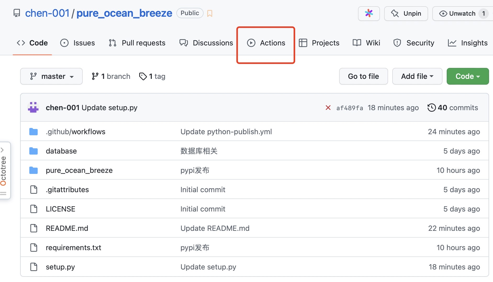
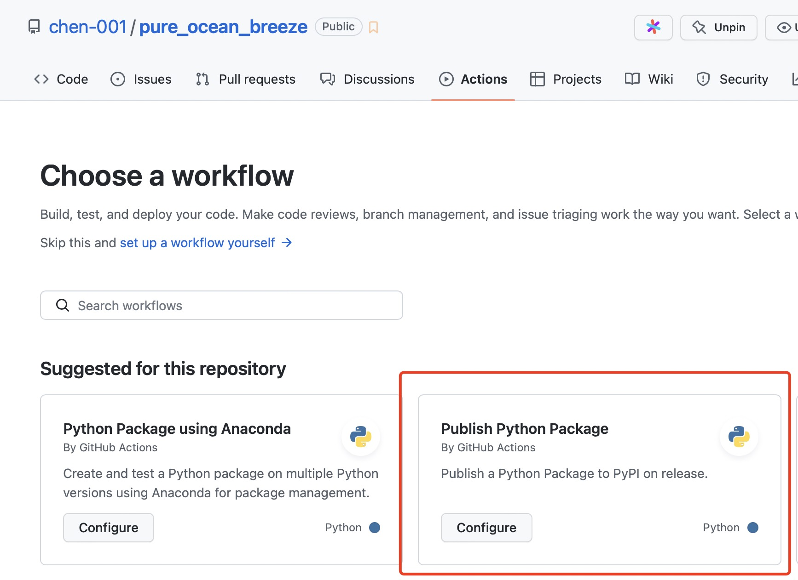
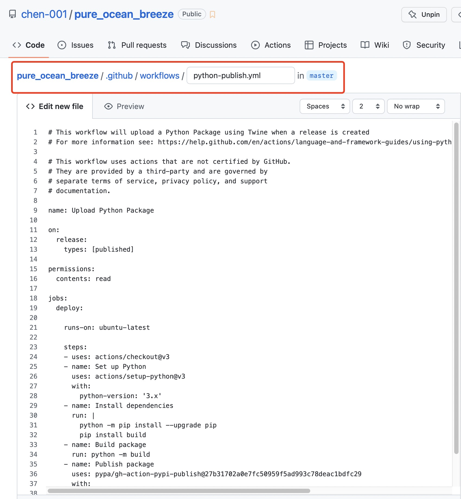
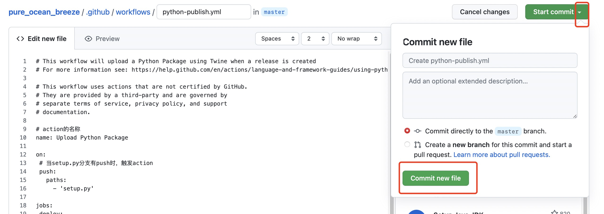
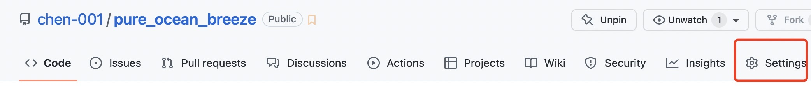
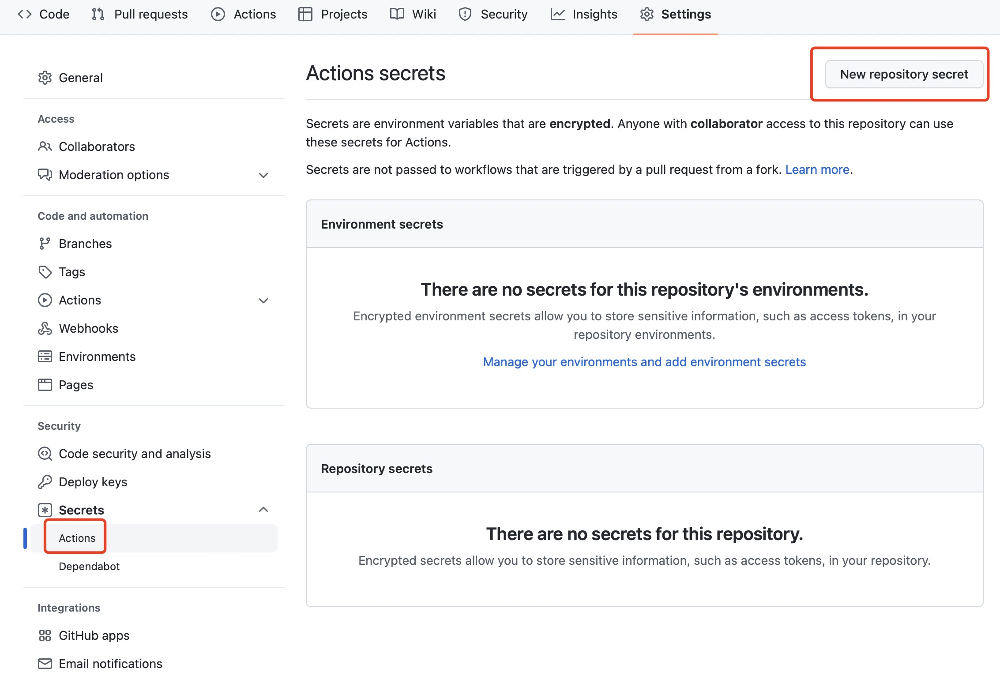
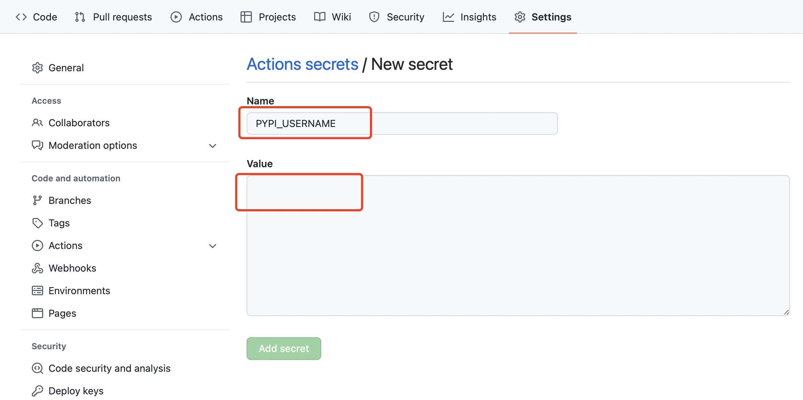
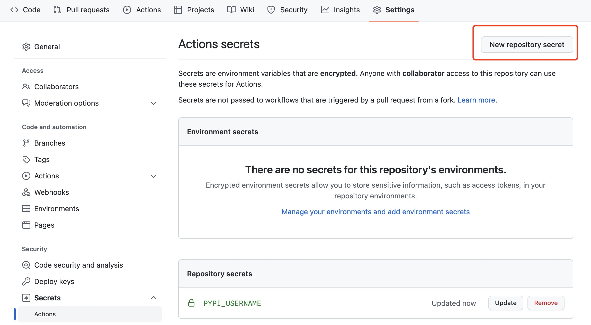
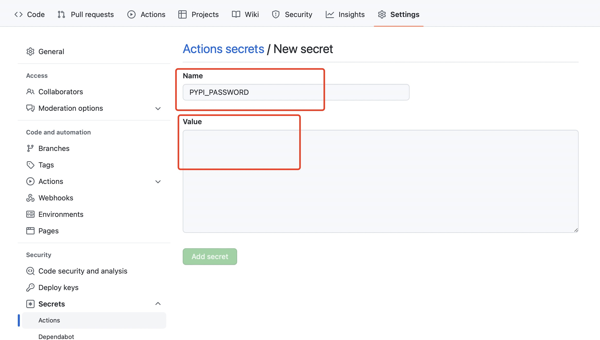
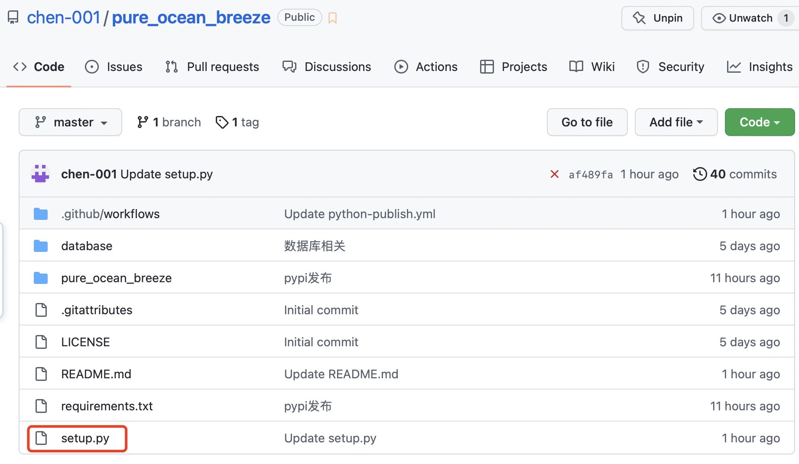

### Github同步Pypi操作手册
---
* #### 步骤一 ➡️ 创建workflow
>1. 在**repository**主页找到**Actions**
>
>2. 在**Actions**中找到**Publish Python Package**
>
>3. 点击**Configure**创建**workflow**
>
>4. 此时自动在主分支下创建了`.github/workflows/python-publish.yml`文件
>
>👏**至此第一步结束啦👏**

* #### 步骤二 ➡️ 设置自动更新动作
>1. **解释**:`python-publish.yml`中的内容即更新动作
>2. 复制如下模板，替换`python-publish.yml`中的内容
>>```yml
>># action的名称
>>name: Upload Python Package
>>
>>on:
>>  # 当setup.py分支有push时，触发action
>>  push: 
>>    paths:
>>      - 'setup.py'
>>
>>jobs:
>>  deploy:
>>    runs-on: ubuntu-latest
>>    steps:
>>      - uses: actions/checkout@v3
>>      - name: Set up Python
>>        uses: actions/setup-python@v4
>>        with:
>>          python-version: '3.x'
>>      - name: Install dependencies
>>        run: |
>>          python -m pip install --upgrade pip
>>          pip install build
>>      - name: Build package
>>        run: python -m build
>>      - name: Publish package
>>        uses: pypa/gh-action-pypi-publish@27b31702a0e7fc50959f5ad993c78deac1bdfc29
>>        with:
>>          user: ${{secrets.PYPI_USERNAME}}
>>          password: ${{secrets.PYPI_PASSWORD}}
>>```
>3. 提交创建`python-publish.yml`文件
>
>
>👏**至此第二步结束啦👏**

* #### 步骤三 ➡️ 设置Pypi账号密码
>1. **解释**：为了不在`python-publish.yml`文件中暴露自己Pypi的账号密码，需要在Github的仓库密钥中设置自己的账号密码。对应在上述`python-publish.yml`文件中的
>>```yml
>>user: ${{secrets.PYPI_USERNAME}}
>>password: ${{secrets.PYPI_PASSWORD}}
>>```
>2. 打开**repository**的**settings**（⚠️注意，并非个人账户的settings）
>
>3. 选择左侧**Secrets**下的**Actions**，然后点击右上角的**New repository secret**
>
>4. 添加新secret，pypi的账号，在Name中输入**PYPI_USERNAME**，在Value中输入自己Pypi账号
>
>5. 再添加一个secret，pypi的密码，在Name中输入**PYPI_PASSWORD**，在Value中输入自己的Pypi密码
>
>
>
>👏**至此第三步结束啦👏**

* #### 步骤四 ➡️ 上传`setup.py`文件
>1. 上传`setup.py`文件
>
>
>👏**至此第四步结束啦👏**

* #### 使用说明
>1. 更新Pypi新版本：更新`setup.py`文件并push，会触发前面设置的Action，从而自动更新Pypi新版本
>2. 其他文件的更新：只要不包含`setup.py`的更新，就不会触发更新Pypi版本的Action